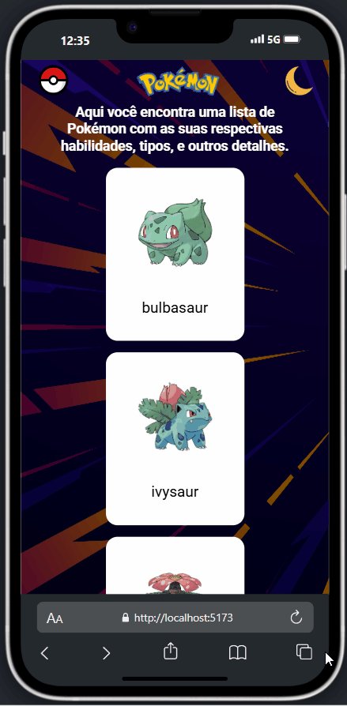
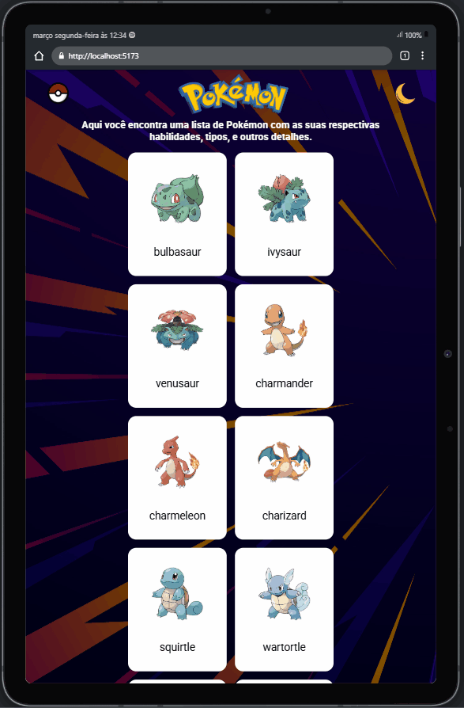

# Pokemons

Este projeto é uma aplicação web interativa que permite aos usuários explorar e visualizar informações detalhadas sobre os Pokémon. A aplicação oferece uma navegação fluida e dinâmica, utilizando diversas funcionalidades para proporcionar uma experiência rica ao usuário.

Página Inicial: Exibe uma lista de Pokémon e seus respectivos nomes.

Detalhes do Pokémon: Ao clicar em um Pokémon, o usuário é redirecionado para uma página de detalhes, onde são exibidos o nome completo, tipo, habilidades, altura e peso.

Tema Escuro/Claro: O site implementa um modo claro/escuro que pode ser alterado por meio de um botão de alternância de tema.

Navegação com React Router: A navegação entre páginas é feita de maneira fluida utilizando o React Router, permitindo uma transição sem recarregar a página.

Gerenciamento de Estado Global com Context API: A aplicação utiliza Context API para gerenciar o estado global, como o tema, em toda a aplicação.

Responsividade: O layout é totalmente responsivo, adaptando-se bem a diferentes tamanhos de tela.

## Screenshot 
Desktop 💻

Mobile 📱

Tablet 📱

## Tecnologias utilizadas 👨‍💻
- HTML
- CSS
- JAVASCRIPT
- REACT
- CONTEXT API
- REACT ROUTER
- STYLED COMPONENTS
- GIT
- VITE